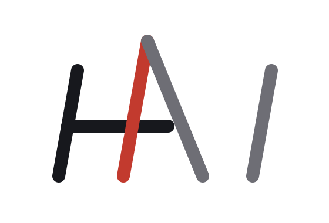
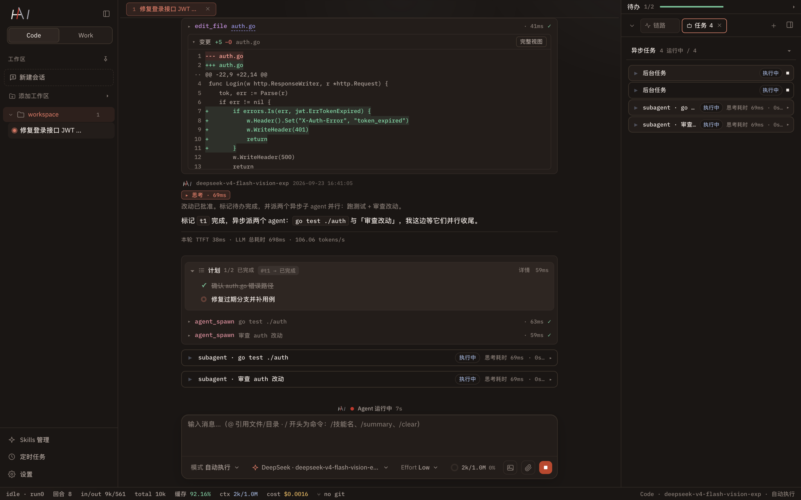
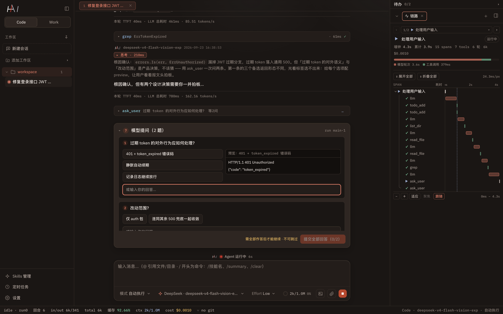
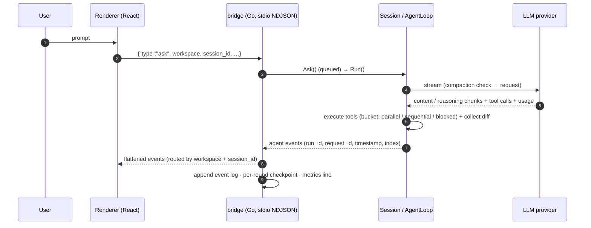

<p align="center">
  <picture>
    <source media="(prefers-color-scheme: dark)" srcset="brand/hai-logo-dark.svg">
    
  </picture>
</p>

<h1 align="center">HAI Harness</h1>

<p align="center">
  <b>Event-driven, long-running Agent Harness in Go.</b><br>
  Model calls · tool execution · context management · crash-safe persistence — as one embeddable runtime.<br>
  Product shells (CLI, desktop app, bot) only <i>drive <code>Session</code> and consume the event stream</i>.
</p>

<p align="center">
  <a href="LICENSE"></a>
  
  
  
  
  <br>
  <a href="README.zh-CN.md">中文文档</a> ·
  <a href="#why-hai-harness">Why</a> ·
  <a href="#architecture">Architecture</a> ·
  <a href="#the-execution-chain-events--trace">Execution chain</a> ·
  <a href="#local-only-session-storage">Local storage</a> ·
  <a href="#quick-start">Quick start</a> ·
  <a href="#repository-layout">Layout</a>
</p>

---

HAI Harness is the engine behind **HAI** (嗨 · *human with AI*): a Go library that owns the whole
lifecycle of an autonomous agent — the ReAct loop, streaming, tool execution, context compaction,
human-in-the-loop approvals, background sub-agents, and persistence that survives crashes.

It is deliberately **not** a product: there is no server, no account, no cloud. Everything a session
produces is written to `~/.go-code/` on your own machine, and every step it takes is on the event
stream. The repository also ships one complete product shell — a Go stdio bridge plus an
Electron/React desktop client — as a reference for what an embedding host looks like.

## A look at the reference client





Both screenshots are the bundled desktop client running against its built-in **mock event stream** — no
API key, no real session data. The client ships an English/Chinese UI (screenshots show the Chinese
locale); the layout is left rail (workspaces, sessions, skills, cron, settings), narrative + tool
cards in the middle, and a right panel that hosts trace, todos, tasks and file previews.

## Why HAI Harness

Four commitments shape the code. They are the reason to pick this harness over a thin HTTP wrapper.

| Commitment | What it means | Where it shows up |
|---|---|---|
| **Event-driven core** | Every step is an event: a closed set of **28 event types**, each self-contained with `run_id` / `request_id` / `timestamp` / `index`. No hidden global state, no callback soup — one `events.EventHandler` is the entire integration surface. | `events/` (types only, zero dependencies), `agents.AgentLoop.RunStream` |
| **Traceable, replayable runs** | The event log **is** the trace store — every `run` / `llm` / `tool` / `compress` / `wait` span start & end is already on disk, so history can be rebuilt instead of re-instrumented. `agent_end` carries finish reason, aggregated usage, duration and artifacts; `request_id` is the upstream provider response id, so a cost entry can be traced back to an exact call. | `desktop/bridge/trace.go`, `~/.go-code/events/*.jsonl` |
| **Local-only session storage** | Sessions, events, metrics, settings, skills and browser profiles all live under `~/.go-code/`. Files are `0600`/`0700`, appended with `fsync`, guarded by `flock`, and committed atomically (`tmp → .bak → rename → fsync(dir)`). There is no server, no telemetry, no upload path in the harness or the client. | `session/store_file.go`, `session/store_record.go`, `desktop/bridge/appdata.go` |
| **Built to run long** | Compaction that only rewrites what is sent to the model, per-round checkpoints, background agents that outlive a run, input-queue backpressure, a cost budget, graceful shutdown and iteration guardrails — the nine mechanisms that make an hours-long session boring instead of scary. | `agents/llm_compressor.go`, `session/`, `subagent/`, `cron/` |

A fifth, structural commitment: **the harness never depends on the product**. The dependency chain is
strictly one-way (`core → events/provider → tools → agents → session → host`), so you can embed the
runtime in your own host without dragging the desktop client along.

### Dogfooding: this repository is built with HAI Harness, on DeepSeek Flash

HAI Harness was written the way it is meant to be used: long, mostly autonomous sessions driven by
**DeepSeek Flash** (the model id in our registry is `deepseek-v4-flash`; point it at whatever your
endpoint serves), with every tool call, file diff and cost figure flowing through the event model
described below. Across a 40-day window of daily use — including the sessions that produced this
repository — **cache reads covered a median 98.5% of input tokens, with the best session at 99.8%**.

That hit rate is not luck, and it is why those runs stay affordable: the prompt prefix is kept
byte-stable on purpose (layered system prompt, dictionary-ordered tool schemas, read-only tool bucket
first), so the provider-side prompt cache keeps hitting across rounds. The numbers above come from real
sessions on that workload, not a synthetic benchmark.

## The execution chain: events & trace

One input, end to end — this is a real ordering, taken from where each event is emitted:

| Step | Events | Notes |
|---|---|---|
| Input accepted | `user_inputs_consumed` | in-queue batching; `Ask` returns immediately |
| Run starts | `agent_start` | `run_id`, model, `context_window`, parent/depth for sub-agents |
| `@` references | `refs_loaded` | workspace files expanded into the first message |
| Context pressure | `compress_start` → `compress_end` | structured summary replaces *the context sent to the model*, never the history |
| Model call | `llm_start` → `content_chunk` / `reasoning_chunk` *(streamed, not persisted)* → `llm_error` *(only when retrying)* → `llm_end` | `llm_end` carries usage: input / output / cache-read / reasoning / cost |
| Tools | `tool_approval_requested` *(HITL modes)* → `tool_run_start` → `tool_run_end` | result, error flag, file **diff**, images, exec metadata, per-tool usage |
| Rounds repeat | `goal_alignment_reminder` *(threshold)* → back to `llm_start` | bounded by iteration guardrails and the cost budget |
| Run settles | `agent_end` | finish reason (`stop` / `tool_call` / `abort` / `error` / `max_iterations`), final reply, all tool calls, aggregated usage, `duration_ms`, artifacts |
| Background work | `task_started` → `task_message` → `task_end` → `task_result_delivered` | sub-agents survive across runs; results are pushed back into the parent context |
| Session lifecycle | `session_persist_error` / `session_budget_exceeded` / `session_run_error` / `session_closed` | failures are events too — nothing fails silently |

The desktop client turns that log into a **trace waterfall**: 5 span kinds (`run` / `llm` / `tool` /
`compress` / `wait`), a parent/child tree by `parent_run_id`, and a detail drawer per span. The
projection is metadata-only (**~263 B per span**; a median trace is 5.8 KB, p99 168 KB, max 714 KB —
against a 42 MB worst-case session log), and span details are **not copied**: the drawer re-reads the
full body by anchor (`tool_id` / `request_id`) from the checkpoint blocks. One source of truth, two
read paths.

## Local-only session storage

```
~/.go-code/
├── sessions/<workspaceKey>/
│   ├── <sessionId>.jsonl             append-only: history · per-round state · compaction · meta  0600, fsync per line
│   ├── <sessionId>.jsonl.lock        flock(LOCK_EX|LOCK_NB) held for the duration of a Run
│   ├── <sessionId>.record.json       SessionRecord: sdk_state + view_checkpoint, same revision
│   └── <sessionId>/agents/<taskId>.jsonl   background-task journals
├── events/<workspaceKey>/<sessionId>.jsonl  the event log = the trace store (chunks are not persisted)
├── metrics.jsonl                     one line per model call: provider · model · raw usage · kind
├── settings.json                     app settings (0600) — provider keys are stored in plaintext
├── cron.json / cron_runs.jsonl        scheduled jobs + run ledger
├── skills/ plugins/ runtime/          global skills, installed plugins, managed Python runtime
├── browser-profile/                   persistent browser profile for Browser Use
└── mesh_node_id                       identity for optional peer-to-peer session mesh (off by default)
```

Properties worth knowing before you trust it with a long session:

- **Recovery granularity is one round.** A checkpoint is written at every turn and at semantic
  boundaries; `SessionRecord` commits `sdk_state` (what the model sees) and `view_checkpoint` (what
  the UI shows) at the *same* revision, so a crashed session resumes with both in agreement.
- **History is append-only.** Compaction rewrites the context sent to the provider; the conversation
  file keeps every message. You can always audit what actually happened.
- **Atomic + exclusive.** Records are replaced atomically with a `.bak` fallback and a monotonic
  revision + checksum; a per-session `flock` keeps two processes from interleaving the same session.
- **Self-protecting.** Built-in file tools refuse to touch `~/.go-code/` itself (except the managed
  `plugins/` and `runtime/` subtrees), so an agent cannot rewrite its own session store.
- **What leaves the machine:** requests to the LLM provider you configured, OAuth token exchanges for
  subscription logins, optional price-table refresh, MCP servers you add, and skill marketplaces you
  add. Nothing else. There is no analytics, no error reporting, no "usage statistics" endpoint in the
  harness or the client — the only bundled third-party code that has telemetry at all (the Google
  `chrome-devtools-mcp` browser plugin) is launched with `--no-usage-statistics` and
  `--redact-network-headers` by default.

> The desktop app has no cloud account: you bring an API key (or OAuth login) and the sessions stay
> in your home directory.

## Architecture

```
┌── product shells ─────────────────────────────────────────────────────────────────────┐
│  desktop/app      Electron + React renderer (transcript · approvals · trace · panels)  │
│  desktop/bridge   Go stdio host: multi-workspace sessions, command routing, NDJSON     │
│  your own host    CLI · service · bot · IDE plugin — drive Session, consume events     │
└───────────────▲───────────────────────────────────────────────────────────────────────┘
                │ commands ⇄ events  (in-process Go API, or NDJSON over stdio)
┌───────────────┴── harness core (Go module, no product dependency) ────────────────────┐
│  session/    long-lived container: input queue · history · usage/cost · approvals ·   │
│              commands · persistence & crash-safe recovery · graceful shutdown         │
│  agents/     the run engine: ReAct loop · compaction · retries/backoff · system-prompt│
│              layering · modes · hooks · runtime reminders                             │
│  tools/      tool protocol + engine (buckets, parallel/sequential, timeout, panic     │
│              guard) + built-in workspace tools (+ sandbox.Sandbox backends)           │
│  provider/   3 protocols · 22 vendor presets · model registry · error classification ·│
│              OAuth subscription login                                                 │
│  events/     the one contract with the outside world (types only)                     │
│  core/       zero-dependency shared types (messages, tools, usage, cost, diff)        │
└───────────────────────────────────────────────────────────────────────────────────────┘
                    subagent/ · todo/ · skills/ · mcp/ · hooks/ · cron/ · plugin/
                    im/ · computer/ · runtime/ · sandbox/
```

Three objects carry everything:

```
Session            long-lived container  — everything that survives a run lives here
 └─ AgentLoop      run engine            — immutable config, safe to reuse/concurrent
     └─ AgentContext per-run state       — created and dropped inside one Run
```



## What's in the box

**Harness core (Go, `github.com/seven7628/hai-harness`)**

- **Run engine** — multi-round ReAct loop, streaming with retry/backoff (429-aware, mid-stream rate-limit detection), dual-layer event translation, iteration guardrails, abort cascading, cancellation.
- **Context compaction** — structured LLM summarization with rolling merges, usage-driven triggering, verbatim retention of task anchors and a recent window, failure degradation, compaction cost accounted for.
- **Crash recovery** — per-round checkpoints, checkpoint-first restore (`SessionRecord` = SDK state + view checkpoint at one revision), legacy migration, session `flock`.
- **Human in the loop** — per-tool `ToolApprovalRequested` + `Session.Approve`, batch questions (`ask_user`, 1–8 questions per call), FIFO approval queue shared across sessions and sub-agents.
- **Commands & hooks** — a slash-command channel that is *not* visible to the model (`RegisterCommand`; built-in `compact` / `skills` / `clear`), plus external-command hooks on 7 lifecycle events (`SessionStart`, `UserPromptSubmit`, `PreToolUse`, `PostToolUse`, `PostToolBatch`, `PreCompact`, `Stop`) with stdin/stdout JSON and content-hash trust for project-level hooks.
- **Sub-agents & background tasks** — synchronous read-only explorers, asynchronous `agent_spawn` / `agent_send` / `agent_interrupt` / `TaskList` / `TaskOutput` with journals on disk, parent/child event trees via `parent_run_id`, and `promote_task` to detach a slow tool call into the background.
- **Workspace tools** — `read_file` / `write_file` / `edit_file` (atomic write + diff) / `grep` / `glob` / `bash` (process-group isolation, minimal env, timeout kills the group, static guardrails for destructive commands) / `run_python` (managed runtime) / `git_worktree` / `ask_user`.
- **Safety layers** — `sandbox.Sandbox` execution backend with a macOS **Seatbelt** implementation (sensitive-path denies, workspace containment, managed-plugin carve-outs, release gate), SSRF-guarded `http_get`, path containment, `0600`/`0700` files, credential redaction in tool output.
- **Context & memory** — `AGENTS.md` / `CLAUDE.md` discovery, 4-layer system prompt (base contract → product → working memory → skills), cache-friendly byte-stable prefixes, `todo_*` that survives compaction and recovery, **Agent Skills** (`SKILL.md`, progressive disclosure, layered global/workspace registry, remote install/update/marketplaces).
- **Integrations** — MCP client (layered config, stdio/http/streamable_http/sse transports, fsnotify hot reload, last-known-good recovery), in-process cron scheduler with a run ledger, Feishu/Lark IM gateway, macOS Computer Use helper, plugin system, optional peer-to-peer session mesh.
- **Observability** — usage/cost per call and per run, cache-hit accounting, context breakdown, artifact collection at `agent_end`, and a metrics ledger for cross-session dashboards.

**Providers** — 3 protocols over one `Provider` interface, **22 vendor presets**, and a model registry with
context windows, output caps, pricing, reasoning/thinking levels and modality flags. Subscription
logins via OAuth (PKCE + device flow) for Anthropic, OpenAI Codex, GitHub Copilot, Kimi Coding,
OpenRouter and xAI; errors are classified (`rate_limit` / `permanent` / `canceled` / `context_exceeded` /
`generic`) and propagated as semantic labels rather than strings.

**Desktop client (reference shell)** — Electron 33 + React 18 + Vite 6 + TypeScript + Tailwind 4 +
Zustand; narrative/activity split panels, transcript, approval center with editable arguments, diff
viewer, todo panel, trace waterfall, usage dashboards, skills & MCP & hooks settings, git panel,
cron pages, browser panel, right-side tab system; driven by a single Go bridge process that hosts
many workspaces and flattens SDK events to NDJSON on stdout.

## Quick start

### A. Desktop app (fastest way to see it)

Requirements: **Go 1.25.5+**, **Node 20.19+ / 22.12+ / 23+**, macOS or Linux (the macOS build also
enables the Seatbelt sandbox and Computer Use helper). On first run you pick a workspace folder and
add a provider key in *Settings → Provider* (or export `DEEPSEEK_API_TOKEN` / `OPENAI_API_KEY` /
`ANTHROPIC_API_KEY` / … before launching).

```bash
git clone https://github.com/seven7628/hai-harness.git
cd hai-harness/desktop/app
npm ci            # a public lockfile is included for reproducible installs

npm run dev       # Vite dev server + Electron against the real Go bridge
# or, browser-only UI with the built-in mock event stream (no bridge, no API key):
npm run dev:vite  # then open http://localhost:5173

npm run build     # bundle renderer + electron + compile the Go bridge
npm run dist:mac  # package a .dmg / .zip (macOS arm64)
npm run check     # type-check + lint
```

The bridge binary is built from source by `npm run build`
(`desktop/bridge` → `desktop/app/dist/hai-bridge`); nothing prebuilt is downloaded.

> **We do not redistribute third-party components.** This tree ships the harness, the bridge, the
> client code and **our own** built-in skills (`desktop/vendor/office-skills/`). Some client features
> look for vendored third-party packages that are intentionally absent:
>
> - Browser Use's default `mcp` engine expects the upstream **`chrome-devtools-mcp`** package. Drop it
>   into `desktop/vendor/chrome-devtools-mcp` (dev) or `Contents/Resources/chrome-devtools-mcp`
>   (packaged) to enable it; without it, the plugin reports a clear "component source missing" error
>   instead of failing silently, and you can switch `browser_engine` to `ego` in settings.
> - The `ego-browser-skill` is not shipped either — ego-lite guidance is simply skipped.
>
> Everything else builds and runs from this tree alone.

### B. Embed the harness in Go

```bash
go get github.com/seven7628/hai-harness@main   # tagged releases will follow
```

```go
package main

import (
	"context"
	"fmt"
	"os"

	"github.com/seven7628/hai-harness/agents"
	"github.com/seven7628/hai-harness/core"
	"github.com/seven7628/hai-harness/events"
	"github.com/seven7628/hai-harness/provider"
	"github.com/seven7628/hai-harness/session"
	"github.com/seven7628/hai-harness/tools"
	"github.com/seven7628/hai-harness/tools/builtin"
)

func main() {
	ctx := context.Background()

	// ① Provider (chat_completions; the responses/anthropic sub-packages are used directly).
	prov, err := provider.NewProvider(provider.ProtocolChatCompletions, provider.Dependencies{},
		"https://api.deepseek.com/v1", os.Getenv("DEEPSEEK_API_TOKEN"), provider.Capabilities{})
	if err != nil {
		panic(err)
	}

	// ② Tool engine rooted at the workspace ③ run engine ④ session store (memory store available).
	eng := tools.NewToolEngine()
	builtin.NewFileTools(".").Register(eng)
	loop := agents.NewAgentLoop(agents.WithProvider(prov), agents.WithModel("deepseek-chat"),
		agents.WithToolEngine(eng), agents.WithMaxTokens(4096))
	store, err := session.NewFileStore("./.sessions")
	if err != nil {
		panic(err)
	}
	s, err := session.NewSession("demo-1", loop, store)
	if err != nil {
		panic(err)
	}
	defer func() { _ = s.Shutdown(ctx) }()

	// ⑤ Consume events — the handler passed to Run is the subscription point.
	handler := func(_ context.Context, e events.Event) {
		switch ev := e.(type) {
		case *events.LLMEnd:
			fmt.Println("llm_end", ev.FinishReason, ev.Usage.Input, ev.Usage.Output)
		case *events.ToolResponse:
			fmt.Println("tool", ev.Name, ev.IsError)
		case *events.AgentEnd:
			fmt.Printf("agent_end %s cost=%dµUSD\n", ev.FinishReason, ev.Usage.Cost.Total)
		}
	}

	// ⑥ Ask queues and returns; Run blocks until the queue drains.
	_ = s.Ask(ctx, core.NewUserMessage(core.Content{Type: "text", Content: "Write hello.txt with write_file"}))
	if err := s.Run(ctx, handler); err != nil {
		panic(err)
	}
}
```

Costs are integer **µUSD** (`core.Cost`) everywhere; `Session.Usage()` aggregates across runs, and
pricing is applied from the model registry (or your overrides), never baked into the stream.

### C. Drive the bridge protocol directly

The desktop bridge is a plain stdio NDJSON host: a command per line on stdin
(`{"id": 1, "type": "ask", "payload": {...}}`) and one flattened event per line on stdout, tagged with
`session_id` + `workspace`. If you want a non-Go host, that protocol is the shortest path — read
`desktop/bridge/main.go` (the file header lists the full command set).

## Providers & models

| Protocol | Presets |
|---|---|
| `chat_completions` (OpenAI-compatible) | deepseek · openai · opencode · kimi · zhipu · groq · mistral · qwen · xiaomi · together · cerebras · baseten · nvidia · huggingface · openrouter |
| `responses` (OpenAI Responses) | xai · openai-codex |
| `anthropic` (Messages) | anthropic · minimax · fireworks · github-copilot · kimi-coding |

Model metadata (context window, max output, pricing, reasoning support, thinking levels, modalities)
ships as a registry with **735 entries** and is user-overridable; a `list_models` command discovers
models for endpoints that have no built-in list. Any OpenAI-compatible gateway works — point
`base_url` at it and pick the protocol.

## Security & privacy

- **Execution sandbox**: on macOS the Seatbelt backend runs shell commands under `sandbox-exec` with a
  generated policy (deny sensitive paths such as `~/.ssh` / `~/.aws`, block writes outside the
  workspace, allow managed-plugin subtrees, with an explicit release gate for exceptions). Linux
  `bwrap` is the next backend on the same interface — until then, run untrusted work in a container.
- **Command guardrails**: static blocking of obviously destructive commands (`rm -rf`, disk
  operations, `sudo`, fork bombs, `curl | sh`), process-group isolation, environment allow-list,
  timeouts that kill the whole group.
- **Untrusted repositories**: project-level configuration is executed — `.mcp.json` stdio servers and
  `.go-code/hooks.json` commands run with your privileges (hooks additionally require a content-hash
  trust decision). Review them before opening a repository you do not control.
- **Credentials**: API keys are stored locally in `settings.json` (`0600`) in plaintext and injected
  into the request transport; OAuth tokens live in the same local store. They are never sent anywhere
  except the provider they belong to.
- **Reporting**: please use GitHub's *Security → Report a vulnerability* (private advisory) instead of
  a public issue for anything exploitable.

## Development

```bash
go build ./...                # compile the harness + bridge
go vet ./...                  # static checks
gofmt -l .                    # formatting (must be empty)

cd desktop/app
npx tsc --noEmit              # renderer + electron type-check
npm run lint                  # eslint
npm run build                 # production bundle + bridge binary
```

This repository is the **publishable subset** of the development tree: harness, bridge and client.
Internal design documents, the unit/E2E suites and dev-time tooling are not published — so a
`go test ./...` here has nothing to run by design, and the app's `package.json` only carries the
scripts that work against the published sources. Style: `gofmt` for Go; two-space indent, single
quotes and ESM for TypeScript.

## Repository layout

| Path | Responsibility | Entry points |
|---|---|---|
| `core/` | Zero-dependency shared types: messages, tool calls, usage, cost, diffs | `Message`, `ToolCall`, `Usage`, `Cost` |
| `events/` | The one integration contract: event types, HITL primitives, tool context, hook types | `Event`, `EventHandler`, `Approver`, `QuestionWaiter` |
| `provider/` | LLM access: protocols, presets, model registry, error classification, OAuth | `Provider`, `NewProvider`, `Registry`, `ClassifyError` |
| `tools/` | Tool protocol + execution engine + built-in workspace tools | `Tool`, `Engine`, `builtin.NewFileTools` |
| `agents/` | Run engine: ReAct loop, compaction, retries, prompt layering, modes, hooks | `NewAgentLoop`, `AgentContext`, `LLMCompressor` |
| `session/` | Long-lived container: queue, history, usage, approvals, commands, persistence | `NewSession`, `FileStore`, `SessionRecord` |
| `subagent/` | Sub-agent tools + asynchronous task registry with on-disk journals | `NewTool`, `NewBackgroundTool`, `Registry` |
| `todo/` `skills/` `mcp/` `hooks/` `cron/` | Session todos · Agent Skills · MCP client · external command hooks · cron scheduler | `todo.Store`, `skills.Registry`, `mcp.Manager`, `hooks.Config`, `cron.Store` |
| `sandbox/` `runtime/` `computer/` `im/` `plugin/` | Sandbox backends · managed Python runtime · macOS Computer Use · IM gateway · plugin system | `Sandbox`, `runtime.Python`, `computer.Executor`, `im.Gateway`, `plugin.Registry` |
| `desktop/bridge/` | Go stdio host: multi-workspace sessions, commands, event flattening, checkpoints, trace projection | `desktop/bridge/main.go` |
| `desktop/app/` | Electron + React client | `desktop/app/src`, `desktop/app/electron` |
| `desktop/vendor/office-skills/` | Our own built-in skills (`SKILL.md` for docx / xlsx / pdf / pptx) that the client syncs into your skills directory | — |
| `brand/` | Logo assets (light/dark) | `brand/hai-logo-light.svg` |

## Contributing

Issues and pull requests are welcome. A few ground rules that keep this codebase reviewable:

1. **Keep the layering one-way.** `core` must stay dependency-free; a product-facing feature belongs in
   the host (`desktop/`), not in the harness.
2. **Events are a public contract.** Adding or changing an event type is an API change — say so in the
   PR and update every consumer.
3. **Never fail silently.** New failure paths should surface as an event, a classified error, or a
   persisted error field; the client is built on that assumption.
4. **Run `gofmt`, `go vet`, `tsc --noEmit` and `eslint` before pushing.** Keep changes narrowly scoped —
   the harness has a wide blast radius.
5. **Do not commit secrets or machine-specific paths.** Provider keys, session logs and absolute home
   paths must not appear in code, tests or docs.

## License

[MIT](LICENSE) © 2026 初识. Dependencies keep their own licenses — see the `go.mod` module list
(Apache-2.0, MIT, BSD-3-Clause and ISC licensed modules) and `desktop/app/package.json` for the
client's npm dependencies. Third-party assets that we ship in our own builds (the Chrome DevTools MCP
package, the ego-lite skill) are deliberately **not** redistributed here; the only bundled skill set is
our own `desktop/vendor/office-skills/`, covered by the MIT license above.
