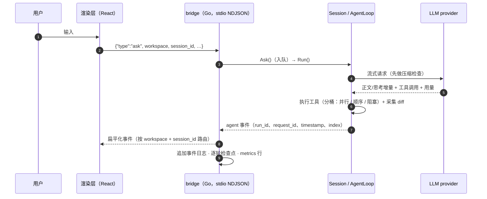

<p align="center">
  <picture>
    <source media="(prefers-color-scheme: dark)" srcset="brand/hai-logo-dark.svg">
    
  </picture>
</p>

<h1 align="center">HAI Harness</h1>

<p align="center">
  <b>事件驱动、长时运行的 Agent Harness（Go）</b><br>
  把「模型调用 · 工具执行 · 上下文管理 · 崩溃安全持久化」封装成一层可嵌入的运行时；<br>
  上层产品（CLI / 桌面端 / 机器人）只负责<i>驱动 <code>Session</code>、消费事件流</i>。
</p>

<p align="center">
  <a href="LICENSE"></a>
  
  
  
  
  <br>
  <a href="README.md">English</a> ·
  <a href="#为什么是-hai-harness">设计取舍</a> ·
  <a href="#架构">架构</a> ·
  <a href="#执行链路事件与-trace">执行链路</a> ·
  <a href="#纯本地会话存储">本地存储</a> ·
  <a href="#快速开始">快速开始</a> ·
  <a href="#目录结构">目录结构</a>
</p>

---

HAI Harness 是 **HAI**（嗨 · *human with AI*）背后的引擎：一个 Go 库，完整承担自主 agent 的生命周期
—— ReAct 循环、流式输出、工具执行、上下文压缩、人工审批、后台子 agent，以及**崩溃可恢复**的持久化。

它刻意不做成产品：**没有服务端、没有账号、没有云端**。会话产生的一切都写在你自己的
`~/.go-code/` 下，走的每一步都在事件流里。仓库同时附带一个完整的参考宿主 —— Go stdio bridge +
Electron/React 桌面端 —— 用来说明「嵌入方长什么样」。

## 参考客户端长什么样


两张图都是随仓库分发的桌面端跑在**内置 mock 事件流**上的样子 —— 不需要 API key、不含任何真实会话数据。
客户端自带中英文界面（截图为中文）；布局是：左栏（工作区 / 会话 / 技能 / 定时 / 设置）、
中间叙述 + 工具卡片、右栏承载链路、待办、任务与文件预览。

## 为什么是 HAI Harness

四条设计承诺决定了代码的形状，也是它区别于「薄薄一层 HTTP 封装」的原因。

| 承诺 | 具体含义 | 落点 |
|---|---|---|
| **事件驱动内核** | 每一步都是事件：**28 个事件类型**的封闭集合，每个事件自包含 `run_id` / `request_id` / `timestamp` / `index`；没有隐式全局状态、没有回调迷宫 —— 一个 `events.EventHandler` 就是全部集成面 | `events/`（只有类型、零依赖）、`agents.AgentLoop.RunStream` |
| **可回溯、可重放** | **事件日志本身就是 trace store** —— 每个 `run` / `llm` / `tool` / `compress` / `wait` span 的起止都已经在盘上，历史链路是「重建」而不是「重新埋点」；`agent_end` 带结束原因、聚合用量、时长与产出；`request_id` 直接取上游响应 id，一笔成本能追回一次具体调用 | `desktop/bridge/trace.go`、`~/.go-code/events/*.jsonl` |
| **纯本地会话存储** | 会话、事件、用量、设置、技能、浏览器 profile 全部落在 `~/.go-code/`；文件 `0600`/`0700`、逐行 `fsync` 追加、`flock` 排他、原子提交（`tmp → .bak → rename → fsync(dir)`）。内核与客户端里没有任何服务端、遥测或上传路径 | `session/store_file.go`、`session/store_record.go`、`desktop/bridge/appdata.go` |
| **为长时运行而建** | 只重写「发给模型的上下文」的压缩、逐轮检查点、跨 Run 存活的后台任务、输入队列背压、成本预算、优雅退出、迭代护栏 —— 九项机制让「跑几小时」变成常态而不是事故 | `agents/llm_compressor.go`、`session/`、`subagent/`、`cron/` |

还有第五条结构性承诺：**内核不依赖产品**。依赖链严格单向
（`core → events/provider → tools → agents → session → 宿主`），所以你可以把运行时嵌进自己的宿主，
而不会被桌面端绑架。

### 自举：本仓库就是用 HAI Harness（DeepSeek Flash）写出来的

HAI Harness 是按「它自己希望被使用的姿势」写出来的：长时、多数自主的会话由 **DeepSeek Flash** 驱动
（注册表里的模型 id 是 `deepseek-v4-flash`；换成你自己端点上的模型即可），每一次工具调用、
每一份文件 diff、每一笔成本，都走下面这套事件模型。在 40 天的日常使用窗口里（包含产出本仓库的那些会话）：
**缓存命中覆盖了输入 token 的中位 98.5%，最好的会话达到 99.8%**。

这个命中率不是运气，也正是这些长跑能跑得起的原因：前缀被刻意保持字节稳定（分层系统提示、
工具 schema 字典序、只读工具桶前置），provider 侧的 prompt cache 才能连续跨轮命中。
上面的数字来自该工作负载上的真实会话，不是合成基准。

## 执行链路：事件与 trace

一次输入，端到端 —— 下面是从「事件发出点」还原出的真实顺序：

| 阶段 | 事件 | 说明 |
|---|---|---|
| 输入进入 | `user_inputs_consumed` | 队列批量消费；`Ask` 入队即返回 |
| 运行开始 | `agent_start` | `run_id`、模型、`context_window`；子 agent 带 parent/depth |
| `@` 引用 | `refs_loaded` | 工作区文件展开进首条消息 |
| 上下文压力 | `compress_start` → `compress_end` | 结构化摘要替换的是**发给模型的上下文**，永不删历史 |
| 模型调用 | `llm_start` → `content_chunk` / `reasoning_chunk`（流式，**不落盘**）→ `llm_error`（仅在重试时）→ `llm_end` | `llm_end` 带用量：输入 / 输出 / 缓存命中 / 推理 / 成本 |
| 工具执行 | `tool_approval_requested`（HITL 模式）→ `tool_run_start` → `tool_run_end` | 结果、错误标记、文件 **diff**、图片、执行元数据、单工具用量 |
| 多轮循环 | `goal_alignment_reminder`（按阈值）→ 回到 `llm_start` | 受迭代护栏与成本预算约束 |
| 运行结算 | `agent_end` | 结束原因（`stop` / `tool_call` / `abort` / `error` / `max_iterations`）、最终回复、全部工具调用、聚合用量、`duration_ms`、产出 |
| 后台任务 | `task_started` → `task_message` → `task_end` → `task_result_delivered` | 子 agent 跨 Run 存活，结果自动回填主会话上下文 |
| 会话生命周期 | `session_persist_error` / `session_budget_exceeded` / `session_run_error` / `session_closed` | 失败也是事件 —— 没有静默失败 |

桌面端把这份日志渲染成**链路瀑布图**：5 种 span（`run` / `llm` / `tool` / `compress` / `wait`）、
按 `parent_run_id` 还原父子树、点开是 span 详情抽屉。投影是**只取元数据**的
（**约 263 B/span**，单条 trace 中位 5.8 KB、p99 168 KB、最大 714 KB —— 对照最坏情况 42 MB 的会话事件日志），
span 正文**不复制**：详情抽屉按锚点（`tool_id` / `request_id`）回查 checkpoint blocks 里的原文。
一份事实，两条读路径。

## 纯本地会话存储

```
~/.go-code/
├── sessions/<workspaceKey>/
│   ├── <sessionId>.jsonl             追加式：history · 逐轮 state · compaction · meta   0600，逐行 fsync
│   ├── <sessionId>.jsonl.lock        flock(LOCK_EX|LOCK_NB)，Run 期间持有
│   ├── <sessionId>.record.json       SessionRecord：sdk_state + view_checkpoint，同一 revision
│   └── <sessionId>/agents/<taskId>.jsonl   后台任务 journal
├── events/<workspaceKey>/<sessionId>.jsonl  事件日志 = trace store（流式增量不落盘）
├── metrics.jsonl                     每次模型调用一行：provider · model · 原始用量 · kind
├── settings.json                     应用设置（0600）—— provider key 以明文存储
├── cron.json / cron_runs.jsonl        定时任务定义 + 运行账本
├── skills/ plugins/ runtime/          全局技能、已装插件、受管 Python 运行时
├── browser-profile/                   Browser Use 的持久浏览器 profile
└── mesh_node_id                       可选会话互联（P2P）的节点标识，默认关闭
```

在把长会话交给它之前，值得知道的几件事：

- **恢复粒度 = 一轮**。每轮以及每个语义边界都会落检查点；`SessionRecord` 把 `sdk_state`（模型看到的）
  与 `view_checkpoint`（界面看到的）按**同一 revision** 原子提交 —— 崩溃恢复后两边停在同一个语义点。
- **历史 append-only**。压缩重写的是发给 provider 的上下文，会话文件里的每一条消息都在，
  事后可以完整审计发生了什么。
- **原子 + 排他**。record 用「临时文件 → `.bak` → rename」原子替换，配单调 revision + 校验和；
  每次会话一把 `flock`，两个进程不会交错写同一会话。
- **自保护**。内置文件工具显式拒绝触碰 `~/.go-code/` 自身（只放行受管的 `plugins/` 与 `runtime/` 子树），
  agent 改不了自己的会话存储。
- **离开本机的只有**：发往你配置的 LLM provider 的请求、订阅登录的 OAuth 换票、可选的价表刷新、
  你自行添加的 MCP 服务器与技能市场。除此之外没有别的 —— 内核与客户端里没有任何埋点、
  错误上报或「使用统计」端点；唯一自带遥测的随包三方代码（Google `chrome-devtools-mcp` 浏览器插件）
  默认以 `--no-usage-statistics` 与 `--redact-network-headers` 启动。

> 桌面端没有云端账号：你自带 API key（或 OAuth 登录），会话留在你的主目录里。

## 架构

```
┌── 产品层（宿主）─────────────────────────────────────────────────────────────────────┐
│  desktop/app      Electron + React 渲染层（转录 · 审批 · 链路 · 各类面板）              │
│  desktop/bridge   Go stdio 宿主：多工作区会话、命令路由、NDJSON                        │
│  你自己的宿主      CLI · 服务 · 机器人 · IDE 插件 —— 驱动 Session、消费事件            │
└───────────────▲───────────────────────────────────────────────────────────────────────┘
                │ 命令 ⇄ 事件（进程内 Go API，或 stdio 上的 NDJSON）
┌───────────────┴── Harness 内核（Go module，不依赖产品）───────────────────────────────┐
│  session/    长时容器：输入队列 · 历史 · 用量/成本 · 审批 · 命令 · 持久化与恢复 · 优雅退出│
│  agents/     运行引擎：ReAct 循环 · 压缩 · 重试退避 · 系统提示分层 · 模式 · Hooks · 提醒 │
│  tools/      工具协议 + 执行引擎（分桶 / 并发 / 超时 / panic 兜底）+ 内置工作区工具      │
│  provider/   3 种协议 · 22 个厂商预设 · 模型注册表 · 错误分类 · OAuth 订阅登录          │
│  events/     对外唯一契约（只有类型，无循环依赖）                                       │
│  core/       零依赖共享类型（消息 / 工具 / 用量 / 成本 / diff）                          │
└────────────────────────────────────────────────────────────────────────────────────────┘
        subagent/ · todo/ · skills/ · mcp/ · hooks/ · cron/ · plugin/ · im/ · computer/
        runtime/ · sandbox/
```

一切跨轮状态只由三个对象承载：

```
Session            长时容器 —— 所有跨 Run 的状态都在这里
 └─ AgentLoop      运行引擎 —— 配置不可变，可复用、可并发
     └─ AgentContext 单次 Run 的状态 —— 用完即弃
```



## 能力清单

**Harness 内核（Go，`github.com/seven7628/hai-harness`）**

- **运行引擎** —— 多轮 ReAct 循环、流式 + 重试退避（识别 429 与流中段限流）、双层事件翻译、
  迭代护栏、abort 级联、可中断。
- **上下文压缩** —— LLM 结构化摘要 + 滚动合并、真实 usage 触发、任务锚点与近窗原文逐字保留、
  失败降级保持原上下文、压缩成本计入账。
- **崩溃恢复** —— 逐轮检查点、checkpoint-first 恢复（`SessionRecord` = SDK 状态 + 视图检查点同 revision）、
  legacy 迁移、会话 `flock`。
- **人在环里（HITL）** —— 逐个危险工具的 `ToolApprovalRequested` + `Session.Approve`、
  批量提问（`ask_user`，一次 1~8 个问题）、跨会话/子 agent 共享的审批 FIFO 队列。
- **命令与 Hooks** —— 与模型**不同源、模型不可见**的斜杠命令通道（`RegisterCommand`；内置
  `compact` / `skills` / `clear`），以及 7 个生命周期事件上的外部命令 hook（`SessionStart`、
  `UserPromptSubmit`、`PreToolUse`、`PostToolUse`、`PostToolBatch`、`PreCompact`、`Stop`），
  stdin/stdout JSON 协议 + 项目层按命令内容哈希的信任门禁。
- **子 agent 与后台任务** —— 同步只读调研子 agent；异步 `agent_spawn` / `agent_send` /
  `agent_interrupt` / `TaskList` / `TaskOutput`，任务输出 journal 落盘，`parent_run_id` 还原父子事件树；
  `promote_task` 把慢工具调用摘到后台。
- **工作区工具** —— `read_file` / `write_file` / `edit_file`（原子写 + diff）/ `grep` / `glob` /
  `bash`（进程组隔离、最小环境、超时杀整组、高危命令静态拦截）/ `run_python`（受管运行时）/
  `git_worktree` / `ask_user`。
- **安全纵深** —— `sandbox.Sandbox` 执行后端，macOS **Seatbelt** 已落地（敏感路径 deny、工作区外写入拦截、
  受管插件子树放行、放行门）；`http_get` 带 SSRF 防护；路径 containment；文件 `0600`/`0700`；
  工具输出里的凭据脱敏。
- **上下文与记忆** —— `AGENTS.md` / `CLAUDE.md` 递归发现、四层系统提示（基础契约 → 产品层 →
  工作记忆 → 技能清单）、缓存友好的字节稳定前缀、压缩与恢复都幸存的 `todo_*`、
  **Agent Skills**（`SKILL.md` + 渐进披露 + 全局/工作区分层注册表 + 远程安装/更新/市场）。
- **集成** —— MCP 客户端（分层配置 + stdio/http/streamable_http/sse + fsnotify 热重载 + 坏配置
  last-known-good 兜底）、进程内 cron 调度器 + 运行账本、飞书 IM 网关、macOS Computer Use 辅助进程、
  插件系统、可选的会话互联（P2P）。
- **可观测性** —— 单次调用与单次 Run 的用量/成本、缓存命中口径、上下文构成拆解、
  `agent_end` 上的产出收集，以及跨会话看板用的 metrics 账本。

**Provider** —— 一个 `Provider` 接口承载 3 种协议、**22 个厂商预设**，模型注册表带窗口、输出上限、
价表、推理/思考档位与模态标记。OAuth（PKCE + device flow）订阅登录支持 Anthropic、OpenAI Codex、
GitHub Copilot、Kimi Coding、OpenRouter、xAI；错误被分类为
`rate_limit` / `permanent` / `canceled` / `context_exceeded` / `generic` 语义标签而非裸字符串。

**桌面端（参考宿主）** —— Electron 33 + React 18 + Vite 6 + TypeScript + Tailwind 4 + Zustand：
叙述/活动双通道、Agent 转录、可编辑参数的审批中心、diff 查看、待办面板、链路瀑布图、用量看板、
技能/MCP/Hooks 设置、Git 面板、定时任务页、浏览器面板、右侧标签体系；由**单个 Go bridge 进程**
承载多工作区，并把 SDK 事件扁平化成 stdout 上的 NDJSON。

## 快速开始

### A. 桌面端（最快看到效果）

环境：**Go 1.25.5+**、**Node 20.19+ / 22.12+ / 23+**、macOS 或 Linux（macOS 构建额外启用 Seatbelt 沙箱
与 Computer Use）。首次启动选择一个工作区目录，然后在「设置 → Provider」里填 key
（或在启动前导出 `DEEPSEEK_API_TOKEN` / `OPENAI_API_KEY` / `ANTHROPIC_API_KEY` 等）。

```bash
git clone https://github.com/seven7628/hai-harness.git
cd hai-harness/desktop/app
npm ci            # 仓库带公共 lockfile，可复现安装

npm run dev       # Vite + Electron，连真实 Go bridge
# 只想看界面（内置 mock 事件流，不需要 bridge、不需要 API key）：
npm run dev:vite  # 然后打开 http://localhost:5173

npm run build     # 打包渲染层 + electron + 编译 Go bridge
npm run dist:mac  # 打 .dmg / .zip（macOS arm64）
npm run check     # 类型检查 + lint
```

bridge 二进制由 `npm run build` 从源码编译
（`desktop/bridge` → `desktop/app/dist/hai-bridge`），不下载任何预编译产物。

> **我们不再分发三方组件。** 本树包含：内核、bridge、客户端代码，以及**我们自己的**内置技能
> （`desktop/vendor/office-skills/`）。有少数功能会去找三方资产，而那些资产被有意排除：
>
> - Browser Use 的默认 `mcp` 引擎需要上游 **`chrome-devtools-mcp`** 包。要启用它，把它放到
>   `desktop/vendor/chrome-devtools-mcp`（dev）或 `Contents/Resources/chrome-devtools-mcp`（打包态）；
>   没有它时插件会给明确的「内置组件源缺失」错误而不是静默失败，也可以在设置里把
>   `browser_engine` 切到 `ego`。
> - `ego-browser-skill` 同样不随树分发 —— ego lite 的引导技能会被跳过。
>
> 除此之外（内核、bridge、客户端、办公技能）都能只用这棵树构建并运行。

### B. 把 Harness 嵌进 Go 程序

```bash
go get github.com/seven7628/hai-harness@main   # 带 tag 的版本随后补上
```

```go
package main

import (
	"context"
	"fmt"
	"os"

	"github.com/seven7628/hai-harness/agents"
	"github.com/seven7628/hai-harness/core"
	"github.com/seven7628/hai-harness/events"
	"github.com/seven7628/hai-harness/provider"
	"github.com/seven7628/hai-harness/session"
	"github.com/seven7628/hai-harness/tools"
	"github.com/seven7628/hai-harness/tools/builtin"
)

func main() {
	ctx := context.Background()

	// ① Provider（chat_completions；responses / anthropic 由子包直接使用）
	prov, err := provider.NewProvider(provider.ProtocolChatCompletions, provider.Dependencies{},
		"https://api.deepseek.com/v1", os.Getenv("DEEPSEEK_API_TOKEN"), provider.Capabilities{})
	if err != nil {
		panic(err)
	}

	// ② 工具引擎（工作区根）③ 运行引擎 ④ 会话存储（也可换内存存储）
	eng := tools.NewToolEngine()
	builtin.NewFileTools(".").Register(eng)
	loop := agents.NewAgentLoop(agents.WithProvider(prov), agents.WithModel("deepseek-chat"),
		agents.WithToolEngine(eng), agents.WithMaxTokens(4096))
	store, err := session.NewFileStore("./.sessions")
	if err != nil {
		panic(err)
	}
	s, err := session.NewSession("demo-1", loop, store)
	if err != nil {
		panic(err)
	}
	defer func() { _ = s.Shutdown(ctx) }()

	// ⑤ 消费事件 —— 传给 Run 的 handler 就是唯一的订阅入口
	handler := func(_ context.Context, e events.Event) {
		switch ev := e.(type) {
		case *events.LLMEnd:
			fmt.Println("llm_end", ev.FinishReason, ev.Usage.Input, ev.Usage.Output)
		case *events.ToolResponse:
			fmt.Println("tool", ev.Name, ev.IsError)
		case *events.AgentEnd:
			fmt.Printf("agent_end %s cost=%dµUSD\n", ev.FinishReason, ev.Usage.Cost.Total)
		}
	}

	// ⑥ Ask 入队即返回；Run 阻塞到队列清空
	_ = s.Ask(ctx, core.NewUserMessage(core.Content{Type: "text", Content: "用 write_file 写 hello.txt"}))
	if err := s.Run(ctx, handler); err != nil {
		panic(err)
	}
}
```

成本统一是整数 **µUSD**（`core.Cost`）；`Session.Usage()` 聚合跨 Run 用量，价格来自模型注册表
（或你的覆盖配置），不掺进流里。

### C. 直接对接 bridge 协议

桌面端 bridge 就是一个普通的 stdio NDJSON 宿主：stdin 一行一个命令
（`{"id": 1, "type": "ask", "payload": {...}}`），stdout 一行一个扁平化事件，带
`session_id` + `workspace` 路由键。如果你的宿主不是 Go，这是最短的接入路径 ——
读 `desktop/bridge/main.go`（文件头列了完整命令集）。

## Provider 与模型

| 协议 | 厂商预设 |
|---|---|
| `chat_completions`（OpenAI 兼容） | deepseek · openai · opencode · kimi · zhipu · groq · mistral · qwen · xiaomi · together · cerebras · baseten · nvidia · huggingface · openrouter |
| `responses`（OpenAI Responses） | xai · openai-codex |
| `anthropic`（Messages） | anthropic · minimax · fireworks · github-copilot · kimi-coding |

模型元数据（上下文窗口、输出上限、价表、推理支持、思考档位、模态）以注册表形式随包分发，
共 **735 条**，可被用户覆盖；对没有内置清单的端点，用 `list_models` 命令现场发现。
任何 OpenAI 兼容网关都能用 —— 把 `base_url` 指过去、选好协议即可。

## 安全与隐私

- **执行沙箱**：macOS 上 Seatbelt 后端用 `sandbox-exec` 生成策略运行 shell 命令
  （deny 敏感路径如 `~/.ssh` / `~/.aws`、拦工作区外写入、放行受管插件子树，并对例外设显式放行门）。
  Linux `bwrap` 是同一接口上的下一个后端 —— 在那之前，不可信任务请放在容器里跑。
- **命令护栏**：静态拦截明显破坏性命令（`rm -rf`、磁盘操作、`sudo`、fork 炸弹、`curl | sh`）、
  进程组隔离、环境变量白名单、超时杀整组。
- **不可信仓库**：项目层配置是会被执行的 —— `.mcp.json` 里的 stdio 服务器与
  `.go-code/hooks.json` 里的命令会以你的权限运行（hook 额外需要按内容哈希的信任决定）。
  打开来路不明的仓库前请先审阅这些文件。
- **凭据**：API key 以明文存放在本机 `settings.json`（`0600`）并注入请求 transport，
  OAuth token 也在同一个本地存储里；除所属 provider 外不会发往任何地方。
- **漏洞报告**：可利用问题请走 GitHub 的 *Security → Report a vulnerability*（私有 advisory），
  不要开公开 issue。

## 开发

```bash
go build ./...                # 编译内核 + bridge
go vet ./...                  # 静态检查
gofmt -l .                    # 格式（必须为空）

cd desktop/app
npx tsc --noEmit              # 渲染层 + electron 类型检查
npm run lint                  # eslint
npm run build                 # 生产打包 + bridge 二进制
```

本仓库是开发仓库的**可发布子集**：内核、bridge、客户端。内部设计文档、单元/E2E 测试套件与
开发期工具链不在发布范围 —— 因此这里的 `go test ./...` 按设计就是空的，桌面端 `package.json`
也只保留能在已发布源码上跑通的命令。风格：Go 用 `gofmt`；TypeScript 两空格缩进、单引号、ESM。

## 目录结构

| 路径 | 负责的能力 | 关键入口 |
|---|---|---|
| `core/` | 零依赖共享类型：消息、工具调用、用量、成本、diff | `Message`、`ToolCall`、`Usage`、`Cost` |
| `events/` | 对外唯一契约：事件类型、HITL 原语、工具上下文、Hook 类型 | `Event`、`EventHandler`、`Approver`、`QuestionWaiter` |
| `provider/` | LLM 接入：三协议、厂商预设、模型注册表、错误分类、OAuth | `Provider`、`NewProvider`、`Registry`、`ClassifyError` |
| `tools/` | 工具协议 + 执行引擎 + 内置工作区工具 | `Tool`、`Engine`、`builtin.NewFileTools` |
| `agents/` | 运行引擎：ReAct 循环、压缩、重试、提示分层、模式、Hooks | `NewAgentLoop`、`AgentContext`、`LLMCompressor` |
| `session/` | 长时容器：队列、历史、用量、审批、命令、持久化 | `NewSession`、`FileStore`、`SessionRecord` |
| `subagent/` | 子 agent 工具 + 异步任务注册表（journal 落盘） | `NewTool`、`NewBackgroundTool`、`Registry` |
| `todo/` `skills/` `mcp/` `hooks/` `cron/` | 会话待办 · Agent Skills · MCP 客户端 · 外部命令 hooks · 定时调度 | `todo.Store`、`skills.Registry`、`mcp.Manager`、`hooks.Config`、`cron.Store` |
| `sandbox/` `runtime/` `computer/` `im/` `plugin/` | 沙箱后端 · 受管 Python · macOS Computer Use · IM 网关 · 插件系统 | `Sandbox`、`runtime.Python`、`computer.Executor`、`im.Gateway`、`plugin.Registry` |
| `desktop/bridge/` | Go stdio 宿主：多工作区会话、命令路由、事件扁平化、检查点、trace 投影 | `desktop/bridge/main.go` |
| `desktop/app/` | Electron + React 客户端 | `desktop/app/src`、`desktop/app/electron` |
| `desktop/vendor/office-skills/` | 我们自己的内置技能（docx / xlsx / pdf / pptx 的 `SKILL.md`），客户端启动时同步到你的技能目录 | — |
| `brand/` | 品牌 logo（深/亮两版） | `brand/hai-logo-light.svg` |

## 参与贡献

欢迎 issue 与 PR。几条让评审可控的约定：

1. **保持依赖单向。** `core` 必须零依赖；面向产品的功能留在宿主（`desktop/`），不要塞进内核。
2. **事件是公开契约。** 新增/修改事件类型属于 API 变更 —— 请在 PR 里写明，并同步所有消费方。
3. **不要静默失败。** 新的失败路径必须以事件、分类错误或持久化错误字段暴露出来；客户端的全部假设建立在这条之上。
4. **推送前跑 `gofmt`、`go vet`、`tsc --noEmit`、`eslint`。** 改动尽量收窄 —— 内核的影响面很宽。
5. **不要提交密钥与本机路径。** provider key、会话日志、绝对家目录路径都不得出现在代码、测试与文档里。

## 许可证

[MIT](LICENSE) © 2026 初识。依赖保留各自许可证 —— 见 `go.mod` 依赖表（Apache-2.0、MIT、BSD-3-Clause、ISC 等）
与 `desktop/app/package.json` 里的 npm 依赖。我们自己构建时会带上的三方资产（Chrome DevTools MCP 包、
ego lite 技能）**不在本仓库再分发**；随本仓库分发的技能只有我们自己的
`desktop/vendor/office-skills/`，适用上面的 MIT 许可证。
